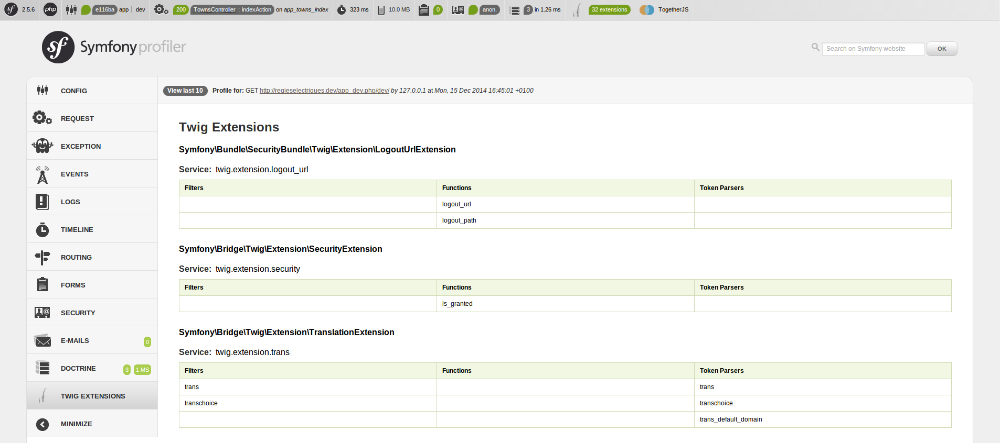

[](https://travis-ci.org/KnpLabs/TwigExplorerBundle)

Installation:
=============
####Composer
```bash
composer require --dev knplabs/twig-explorer-bundle dev-master
```
####AppKernel
```php
<?php

// app/AppKernel.php

public function registerBundles()
{
    $bundles = array(

        // ...

        new Knp\TwigExplorer\KnpTwigExplorerBundle()
    );

    // ...
}
```
Usage
=====
```bash
Usage:
 knp:twig:explorer [query]

Arguments:
 query                 A query string
```

List all filters/functions:
======
####Command
```bash
php app/console knp:twig:explorer
```
####Result
```
 Symfony\Bundle\SecurityBundle\Twig\Extension\LogoutUrlExtension : 
 | Functions               | Filters                           | Token Parsers        |
 | logout_url              |                                   |                      |
 | logout_path             |                                   |                      |

 Symfony\Bridge\Twig\Extension\SecurityExtension : 
 | Functions               | Filters                           | Token Parsers        |
 | is_granted              |                                   |                      |

 Symfony\Bridge\Twig\Extension\TranslationExtension : 
 | Functions               | Filters                           | Token Parsers        |
 |                         | trans                             | trans                |
 |                         | transchoice                       | transchoice          |
 |                         |                                   | trans_default_domain |

 Symfony\Bundle\TwigBundle\Extension\AssetsExtension : 
 | Functions               | Filters                           | Token Parsers        |
 | asset                   |                                   |                      |
 | assets_version          |                                   |                      |

 Symfony\Bundle\TwigBundle\Extension\ActionsExtension : 
 | Functions               | Filters                           | Token Parsers        |
 |                         |                                   | render               |

 Symfony\Bridge\Twig\Extension\CodeExtension : 
 | Functions               | Filters                           | Token Parsers        |
 |                         | abbr_class                        |                      |
 |                         | abbr_method                       |                      |
 |                         | format_args                       |                      |
 |                         | format_args_as_text               |                      |
 |                         | file_excerpt                      |                      |
 |                         | format_file                       |                      |
 |                         | format_file_from_text             |                      |
 |                         | file_link                         |                      |

 Symfony\Bridge\Twig\Extension\RoutingExtension : 
 | Functions               | Filters                           | Token Parsers        |
 | url                     |                                   |                      |
 | path                    |                                   |                      |

 Symfony\Bridge\Twig\Extension\YamlExtension : 
 | Functions               | Filters                           | Token Parsers        |
 |                         | yaml_encode                       |                      |
 |                         | yaml_dump                         |                      |

 #...

```
Search some filters/functions:
======
####Command
```bash
php app/console knp:twig:explorer form
```
####Result
```
 Symfony\Bundle\SecurityBundle\Twig\Extension\LogoutUrlExtension :  None 

 Symfony\Bridge\Twig\Extension\SecurityExtension :  None 

 Symfony\Bridge\Twig\Extension\TranslationExtension :  None 

 Symfony\Bundle\TwigBundle\Extension\AssetsExtension :  None 

 Symfony\Bundle\TwigBundle\Extension\ActionsExtension :  None 

 Symfony\Bridge\Twig\Extension\CodeExtension : 
 | Functions    | Filters               | Token Parsers |
 |              | format_args           |               |
 |              | format_args_as_text   |               |
 |              | format_file           |               |
 |              | format_file_from_text |               |

 Symfony\Bridge\Twig\Extension\RoutingExtension :  None 

 Symfony\Bridge\Twig\Extension\YamlExtension :  None 

 Symfony\Bridge\Twig\Extension\StopwatchExtension :  None 

 Symfony\Bridge\Twig\Extension\ExpressionExtension :  None 

 Symfony\Bridge\Twig\Extension\HttpKernelExtension :  None 

 Symfony\Bridge\Twig\Extension\FormExtension : 
 | Functions    | Filters               | Token Parsers |
 | form_enctype |                       | form_theme    |
 | form_widget  |                       |               |
 | form_errors  |                       |               |
 | form_label   |                       |               |
 | form_row     |                       |               |
 | form_rest    |                       |               |
 | form         |                       |               |
 | form_start   |                       |               |
 | form_end     |                       |               |

 Twig_Extension_Debug :  None 

 Symfony\Bundle\AsseticBundle\Twig\AsseticExtension :  None 

 Doctrine\Bundle\DoctrineBundle\Twig\DoctrineExtension :  None 

 Mopa\Bundle\BootstrapBundle\Twig\MopaBootstrapTwigExtension : 
 | Functions    | Filters               | Token Parsers |
 | form_help    |                       |               |
 | form_tabs    |                       |               |

 Mopa\Bundle\BootstrapBundle\Navbar\Twig\NavbarExtension :  None 

 Knp\RadBundle\Twig\DataTableTwigExtension :  None 

 Knp\RadBundle\Twig\FlashExtension :  None 

 App\Twig\InflectorExtension :  None 

 Knp\TwigExplorer\Twig\StringExtension :  None 

 App\Twig\CountryExtension :  None 
```

Profiler
========


